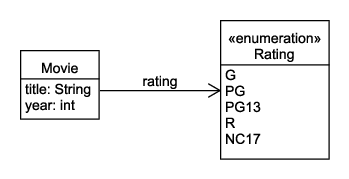
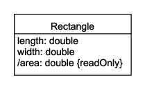

# POJO

A Plain Old Java Object (POJO) is a simple object. (C# calls this a Plain Old CLR Object, or POCO.) There is little or no hiding of data or abstracting of behavior; the internals are directly exposed by getter and setter methods. There may or may not be any validation logic to protect against nulls, empty strings, or invalid values. It is commonly used for request and response objects, for a data transfer object (DTO) that holds data from a database, or just to hold related data.

For example, here is a POJO that represents a movie's title, year of release, and MPA film rating:



Here is how the `Movie` class might be implemented:

```java
public class Movie {
    private String title;
    private int year;
    private Rating rating;

    public Rating getRating() {
        return rating;
    }

    public String getTitle() {
        return title;
    }

    public int getYear() {
        return year;
    }

    public void setRating(Rating rating) {
        this.rating = rating;
    }

    public void setTitle(String title) {
        this.title = title;
    }

    public void setYear(int year) {
        this.year = year;
    }
}
```

Here is another example of a POJO that represents a rectangle:



In the unified modeling language (UML), a property name that is preceded by a forward slash indicates a **derived property** that is computed from other information. In this case, the area of a rectangle is the product of the length and width.

In UML, the `{readOnly}` modifier indicates that the property only has a getter and does not have a setter.

Here is how this class might be implemented:

```java
public class Rectangle {
    private double length;
    private double width;

    public double getArea() {
        return length * width;
    }

    public double getLength() {
        return length;
    }

    public double getWidth() {
        return width;
    }

    public void setLength(double length) {
        if (length <= 0) {
            throw new IllegalArgumentException("must be positive");
        }

        this.length = length;
    }

    public void setWidth(double width) {
        if (width <= 0) {
            throw new IllegalArgumentException("must be positive");
        }

        this.width = width;
    }
}
```

Note that the setters contain logic to validate the input. Generally speaking, it is good practice to write your code assuming anyone who uses it is an idiot and will try to pass bad data to your code. (And remember: future you is also an idiot!) Validation logic protects your code from bad data. This practice is known as **defensive programming**.
